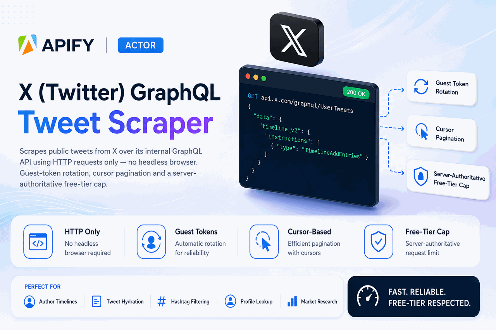

<p align="center">
  
</p>

# x-tweet-scraper

[](https://github.com/JuaniVeltri/x-tweet-scraper/actions/workflows/ci.yaml)
[](package.json)
[](tsconfig.json)
[](https://docs.apify.com/sdk/js/)
[](#the-browserless-approach)

A browserless Apify Actor that collects public posts from X (Twitter) over its internal GraphQL
API, normalizes them to a fixed contract, and enforces a free-tier limit that cannot be lifted
from the input.

No browser engine is involved anywhere in the data path — no Playwright, no Puppeteer, no Selenium,
no headless Chrome. Every request is plain HTTP.

- **Actor:** https://console.apify.com/actors/lPwl0s1DQ18e70W9B
- **Entitlements service:** https://x-tweet-scraper-entitlements.vercel.app/api/health
- **Measured performance:** **8.2 s** to 100 valid results on the Apify platform (Grade A target
  is < 30 s). Method and caveats in [Performance](#performance).

---

## Contents

- [What it does](#what-it-does)
- [Which surfaces are implemented, and why](#which-surfaces-are-implemented-and-why)
- [The investigation: what is reachable without a login](#the-investigation-what-is-reachable-without-a-login)
- [Architecture and data flow](#architecture-and-data-flow)
- [The browserless approach](#the-browserless-approach)
- [Free-tier protection](#free-tier-protection)
- [Input](#input)
- [Output](#output)
- [Running it](#running-it)
- [Performance](#performance)
- [Resilience](#resilience)
- [Tests](#tests)
- [Known limitations](#known-limitations)
- [Terms of service and robots](#terms-of-service-and-robots)

---

## What it does

Given one or more X handles and/or tweet IDs, the Actor fetches the matching public tweets, applies
a set of filters, and pushes each result to the default dataset in a fixed schema.

```
handles ──► UserByScreenName ──► UserTweets (cursor paging) ──┐
                                                              ├──► normalize ──► filter ──► emit
tweet IDs ─► TweetResultByRestId ─────────────────────────────┘                              │
                                                                                             ▼
                                                              entitlement decides how many get through
```

---

## Which surfaces are implemented, and why

| Surface | Operation | Status |
|---|---|---|
| Tweets by author | `UserTweets` | **Implemented.** Guest-reachable. |
| Single tweet by ID | `TweetResultByRestId` | **Implemented.** Guest-reachable. |
| User profile by handle | `UserByScreenName` | **Implemented.** Guest-reachable. |
| Free-text search | `SearchTimeline` | **Not implemented.** Not guest-reachable — see below. |

`searchTerms` is rejected at the input boundary with an explicit, evidence-bearing error rather
than silently returning nothing. The full message is in
[`src/input/parse.ts`](src/input/parse.ts).

---

## The investigation: what is reachable without a login

The assessment's central question is which parts of X's internal API answer to a guest token. The
answer was established empirically, not assumed, and the probes are in the repo
([`scripts/probe.py`](scripts/probe.py), [`scripts/probe2.py`](scripts/probe2.py)).

### The trap: three different 404s

X returns 404 for three unrelated reasons, and conflating them is how you conclude the task is
impossible:

| Response | Meaning | Correct reaction |
|---|---|---|
| `404` + `{"message":"Query not found"}` | The query ID rotated | Re-resolve the ID, retry |
| `404` + **empty body** | Operation exists but is not served to guests | Stop — this is the auth wall |
| `404`, anything else | Genuinely absent | Fail |

### The measurement

Each operation was called with **its own declared contract** — the query ID, feature switches and
field toggles that the operation itself advertises — so that a failure could not be blamed on a
stale ID or a missing flag. A query ID that never existed was included as a control.

Measured 2026-08-19, guest token only:

| Operation | Result | Rate limit |
|---|---|---|
| `UserByScreenName` | **200, data** | 150 / window |
| `UserTweets` | **200, data** | 50 / window |
| `TweetResultByRestId` | **200, data** | 500 / window |
| `SearchTimeline` | 404, empty body | 50 |
| `UserTweetsAndReplies` | 404, empty body | 500 |
| `TweetDetail` | 404, empty body | 150 |
| *(control)* bogus query ID | 404, `{"message":"Query not found"}` | — |

**The control is what makes this conclusive.** A query ID X has never heard of gets a JSON error
that names the problem. `SearchTimeline` gets a silent, empty 404 — and X still attributes its own
rate-limit bucket to the response. X knows exactly which operation was requested, meters it, and
declines to serve it to a guest. That is a deliberate authorization boundary, not a rotated ID.

Raw responses are committed as
[`tests/fixtures/guest-reachability-verdicts.json`](tests/fixtures/guest-reachability-verdicts.json).

Making `searchTerms` work would require a non-personal, programmatically obtained logged-in
session. That is a standing bonus, not a requirement, and it was deliberately not attempted: the
hard constraints forbid a personal session, and a half-working search that trips bans is worse than
an honest refusal.

### The observed rate limits are a design input, not trivia

`UserTweets` at 50 requests per window is the binding constraint on the whole Actor. At 40 tweets
per page, one guest token is worth roughly 2,000 tweets. That is why the token pool rotates rather
than reusing a single token, and why concurrency is applied across handles rather than within one
timeline.

---

## Architecture and data flow

```
src/
├── main.ts                     wiring only — no policy lives here
├── input/                      zod schema + boundary validation
├── entitlements/               ← decides the item cap
│   ├── identity.ts             who is running this, cross-checked with the platform
│   ├── verify.ts               HMAC verification, nonce, freshness
│   ├── resolver.ts             ordered authorities, fail-closed
│   └── stores/                 signed endpoint (primary), key-value store (fallback)
├── x/                          the browserless access layer
│   ├── guest-token.ts          acquire / cache / rotate / retire
│   ├── query-ids.ts            runtime resolution from x.com's own bundle
│   ├── features.ts             feature switches, with error-driven negotiation
│   ├── http.ts                 transport (got-scraping)
│   ├── client.ts               retry policy driven by failure classification
│   └── operations/             the three guest-reachable operations
├── normalize/                  raw GraphQL → the output contract
├── filters/                    §4 post-filters, AND semantics
└── pipeline/
    ├── emitter.ts              ← the enforcement point
    ├── dedupe.ts               global seen-set + stall detection
    ├── state.ts                migration-safe resume
    └── run.ts                  orchestration
```

Two boundaries carry the design:

1. **`entitlements/resolver.ts` is the only thing that may set a cap.** No input value reaches it.
2. **`pipeline/emitter.ts` is the only thing that may write to the dataset.** Its limit is fixed at
   construction and has no setter.

Everything else is replaceable without touching either guarantee.

---

## The browserless approach

### Authentication

A guest token (`POST /1.1/guest/activate.json`) paired with the public web bearer that x.com's own
frontend ships to every logged-out visitor. No cookies, no personal session, no credentials
(assessment §3).

### Query IDs — where they live and how they change

Each GraphQL operation is addressed by a rotating opaque ID. Hardcoding them guarantees the Actor
breaks on X's schedule. They are resolved at runtime, and finding them took some digging, because
**x.com currently serves two different frontends and the route decides which one you get**:

| Route | Frontend | Carries our operations? |
|---|---|---|
| `/`, `/<handle>` | New Vite + TanStack Router + Relay app, `abs.twimg.com/x-web/` | **No.** Only 24 persisted queries, all UI chrome (titles, hover cards). The timeline is server-rendered, so no timeline operation exists in the bundle at all. |
| `/home`, `/i/flow/login` | Legacy webpack app, `abs.twimg.com/responsive-web/client-web/` | **Yes.** `main.*.js` carries 104 operations, including all three. |

Targeting a profile URL — the intuitive choice — finds nothing. The resolver therefore fetches
`/home`, extracts the bundle URLs, and mines `main.*.js` for `queryId` / `operationName` pairs.

The resolution chain degrades rather than failing:

1. Key-value store cache (survives migrations, 6 h TTL)
2. **Live extraction from x.com's bundle** — first-party and self-healing
3. A public daily-regenerated dump — no browser, but a third-party dependency
4. Compiled-in constants — last resort

A live run logs which one answered: `Resolved X query IDs {"source":"live-bundle","operations":104}`.

When X replies `404 {"message":"Query not found"}`, the resolver is invalidated and the request
retried — so a mid-run rotation costs one retry rather than the run.

### Feature switches negotiate themselves

X rejects a request that omits any feature switch the operation declares, and the set changes as X
ships features. Rather than a hardcoded list that silently rots, the Actor sends a superset and
reads X's own rejection: the error names the missing switch, which is then added and the request
retried. A newly introduced flag heals within one request instead of requiring a redeploy.

---

## Free-tier protection

Free runs receive at most **10 items**. Entitled runs receive up to their requested `maxResults`.

### How the cap is decided

1. **Identity.** `Actor.getEnv().userId` reads `APIFY_USER_ID` — a variable the person running the
   Actor can set. Taking it at face value would make this a client-side check, so the claimed ID is
   cross-checked against **Apify's own record of the run** (`GET /v2/actor-runs/{runId}`), which
   reports who actually started it and lives on Apify's servers. Disagreement, or an unreadable
   record, marks the identity unverified.
2. **Entitlement.** An unverified identity is never even asked about. A verified one is sent to a
   signed endpoint the author controls, which returns an HMAC-signed claim.
3. **Verification.** The signature is checked with a constant-time comparison. The run's random
   nonce must come back inside the signed payload, and the claim must be fresh.
4. **Enforcement.** The resulting cap is fixed at emitter construction. `maxResults` is applied only
   as `min(requested, cap)`.

### Why each bypass fails

| Attempt | Why it fails |
|---|---|
| `maxResults: 1000000` | The cap is never derived from input. `maxResults` can only narrow. |
| Undocumented input fields | Unknown keys are stripped, and no input key feeds the resolver. |
| Editing `APIFY_USER_ID` | Contradicts the platform's run record → identity unverified → capped. |
| Blocking the entitlements service | Unreachable authority → fail closed → capped. |
| Spoofing DNS to return `{"tier":"paid"}` | No signing key, so the claim fails verification. |
| Replaying a captured genuine "paid" response | It answers a nonce this run never issued. |
| Reading the public source for a client-side check | There isn't one — the source of truth is off-box. |

### Anti-fork reasoning

Both authorities are reached with **Actor-level secret credentials**. Apify attaches those to the
Actor, not to the run: a user who runs the published Actor gets them injected but cannot read them,
and a user who forks the source gets the code with no secret at all. A fork therefore cannot obtain
a claim that verifies, and falls closed to 10.

A fork can of course delete the check — the source is public. That is not the threat this protects
against, and pretending otherwise would be dishonest. What it protects is the **hosted service**:
the author's compute, proxy budget and maintained query-ID resolution. A fork runs on the forker's
own account and quota, consuming none of it. If the extraction itself had to be protected, the
escalation is to move it behind the same signed service, so that a fork has nothing to run.

### Fail-closed, exhaustively

Unreachable service, malformed body, invalid signature, replayed nonce, wrong subject, stale claim,
unknown user, unverifiable identity, **no entitlements configuration at all** — every one resolves
to the free tier. There is no path returning a raised cap without both a verified identity and a
verified claim.

### Verified on the platform

Same Actor, same input, the only difference being whether the user was on the allow-list:

```
Entitled:      requested 100,  fetched 107,  pushed 100,  limited false,  tier paid
Not entitled:  requested 1000, fetched 10,   pushed 10,   limited true,   tier free
               {"limited":true,"reason":"free_tier","cap":10}
```

Note `fetched: 10` against `requested: 1000`. The capped run made two requests and stopped — it
stops **fetching**, not merely pushing, so a free run does not burn the API on data it will discard.

---

## Input

At least one of `fromUsers` or `tweetIds` is required. Unspecified filters mean "no constraint";
filters combine with **AND**. Full schema: [`.actor/INPUT_SCHEMA.json`](.actor/INPUT_SCHEMA.json).

| Field | Type | Meaning |
|---|---|---|
| `fromUsers` | `string[]` | Handles, without `@`. |
| `tweetIds` | `string[]` | Tweet IDs to hydrate. |
| `searchTerms` | `string[]` | **Rejected** with an explanation — not guest-reachable. |
| `hashtags` | `string[]` | Must contain all of these, without `#`. |
| `since` / `until` | ISO date | Inclusive window. A bare `until` date covers the whole day. |
| `language` | ISO-639-1 | Detected tweet language. |
| `minLikes` / `minRetweets` / `minReplies` | integer | Engagement floors. |
| `onlyVerified` | boolean | Includes blue, gold (business) and grey (government) checkmarks. |
| `mediaType` | enum | `any`, `text_only`, `images`, `video`, `links`. |
| `includeReplies` / `includeRetweets` | boolean | Both default `false`. |
| `sortBy` | enum | `latest` (default) or `top`. |
| `maxResults` | integer | Requested cap. Subject to the entitlement. |
| `webhookUrl` | string | Optional. The run summary is POSTed here on finish. |
| `proxyConfiguration` | object | Standard Apify proxy object; residential supported. |

The finish webhook fires only after the dataset and the `OUTPUT` record are durable, so a
delivery failure costs a notification and never the run's results. The URL is caller-supplied and
an Actor is a server-side HTTP client, so the target is validated first: http/https only, and
loopback, link-local and cloud-metadata hosts are refused.

```json
{
  "fromUsers": ["apify", "elonmusk"],
  "hashtags": ["buildinpublic"],
  "since": "2025-01-01",
  "language": "en",
  "minLikes": 25,
  "mediaType": "any",
  "includeReplies": false,
  "includeRetweets": false,
  "sortBy": "latest",
  "maxResults": 500,
  "proxyConfiguration": { "useApifyProxy": true, "apifyProxyGroups": ["RESIDENTIAL"] }
}
```

---

## Output

Every dataset item conforms exactly to the contract. Missing values are `null` — never omitted,
never `undefined`. IDs are strings, because X's snowflake IDs exceed `Number.MAX_SAFE_INTEGER` and
routing one through a JS number corrupts it silently. Timestamps are ISO-8601 UTC.

A real item from a live run:

```json
{
  "id": "2087572956683567110",
  "url": "https://x.com/apify/status/2087572956683567110",
  "text": "Everything runs on Apify. One day. San Francisco. … Get your tickets now → http://apify.it/X054l",
  "lang": "en",
  "createdAt": "2026-08-12T16:12:32.000Z",
  "conversationId": "2087572956683567110",
  "isReply": false,
  "isRetweet": false,
  "isQuote": false,
  "inReplyToId": null,
  "quotedTweetId": null,
  "author": {
    "id": "3510729917", "username": "apify", "name": "Apify",
    "verified": true, "followers": 12047, "following": 296
  },
  "metrics": {
    "likes": 17, "retweets": 4, "replies": 2,
    "quotes": 0, "bookmarks": 1, "views": 2332
  },
  "entities": {
    "hashtags": [], "mentions": [], "urls": ["http://apify.it/X054l"],
    "media": [{ "type": "photo", "url": "https://pbs.twimg.com/media/HPiMidvXgAEpJ53.jpg", "thumbnail": null }]
  },
  "source": "Agorapulse app",
  "scrapedAt": "2026-08-19T01:51:12.965Z"
}
```

`t.co` shortlinks are expanded in `text`; `source` is stripped from its anchor markup.

### Two live user schemas

X is mid-migration. Newer query IDs return `user.legacy: null` with fields split across `core`,
`relationship_counts` and `verification`; older ones return the legacy shape. The normalizer reads
through an ordered list of candidate paths for each field, and the test suite runs the **same
assertions against captured responses of both**, asserting they normalize identically. A rotation
that flips X to the other shape is therefore a non-event.

---

## Running it

### On Apify

```bash
apify call lPwl0s1DQ18e70W9B --input-file=input.json
```

Or from the Console: https://console.apify.com/actors/lPwl0s1DQ18e70W9B

### Locally

```bash
npm ci
mkdir -p storage/key_value_stores/default
echo '{"fromUsers":["apify"],"maxResults":25}' > storage/key_value_stores/default/INPUT.json
npm start
```

A local run has no platform run record, so identity cannot be verified and the free-tier cap
applies. That is the fail-closed path working as designed, and it is the easiest way to see it.

### Deploying your own

```bash
# 1. The entitlements service
cd services/entitlements
vercel deploy --prod
vercel env add ENTITLEMENTS_SECRET production      # a strong random string
vercel env add ENTITLED_USER_IDS production        # comma-separated Apify user IDs

# 2. The Actor
apify secrets add x-entitlements-secret <the same secret>
# point ENTITLEMENTS_URL in .actor/actor.json at your deployment
apify push
```

`ENTITLED_USER_IDS` accepts `userId` or `userId:cap` entries.

### Development

```bash
npm run verify   # typecheck (src and tests) + lint + tests
npm run build
```

---

## Performance

**8.2 s to 100 valid results**, measured on the Apify platform. Grade A is < 30 s.

From the run summary of `BRHnTaFZKTIEMAIlZ`:

```json
{"requested":100,"fetched":107,"pushed":100,"durationMs":8153,
 "requests":7,"errors":{"retryable":0,"fatal":0},"tokenRotations":0}
```

Seven requests, no retries, no 429s, no rotations. The window covers query-ID resolution, profile
lookup and three pages of 40; cold start and build are excluded, per the brief.

Where the speed comes from: 40 tweets per page rather than the default 20, one profile lookup per
handle rather than per page, a cached query-ID map, concurrency across handles, and stopping the
moment the cap is filled.

### Cost per 1,000 results

Measured, not estimated — the breakdown of the same 100-result run above, at the default 4 GB:

| Component | 100 results | Per 1,000 | Share |
|---|---|---|---|
| Compute units | $0.002731 | $0.0273 | 79% |
| Dataset writes | $0.000500 | $0.0050 | 14% |
| Key-value store | $0.000205 | $0.0021 | 6% |
| Data transfer | $0.000021 | $0.0002 | 1% |
| **Total** | **$0.003457** | **≈ $0.035** | |

Apify Proxy datacenter is included in the plan, so it adds nothing here. Residential is billed
per GB; this run moved ~0.25 MB of traffic per 100 results, so residential would add roughly
$0.002–0.003 per 1,000 at typical per-GB rates.

**The memory knob is the real lever.** Compute is 79% of the bill, and Apify scales CPU with
memory — so memory trades cost against wall-clock directly. Both points below are Grade A:

| Memory | Time to 100 | Cost / 1k | |
|---|---|---|---|
| 4 GB (default) | **8.2 s** | ≈ $0.035 | measured |
| 1 GB | **12.7 s** | ≈ $0.018 | time measured; cost derived from the compute-unit rate |

The default is 4 GB because the brief grades time-to-100. For a large scheduled backfill where
latency does not matter, drop to 1 GB and pay roughly half. The Actor is I/O-bound, which is why
quartering the memory costs only ~55% more wall-clock rather than 4×.

**Honest caveat on the proxy.** The brief measures with a residential proxy. This was measured on
an Apify **free** plan, which reports `RESIDENTIAL` with `availableCount: 0` — residential IPs are
not allocated on that tier, so the run used the account's datacenter proxy. Residential rotation is
fully wired and configurable through `proxyConfiguration`; it is the path you will exercise when you
re-run this on your own account. Expect residential to be somewhat slower per request and rather
harder to rate-limit.

---

## Resilience

Every failure is sorted into one classification, and that verdict alone decides what happens next:

| Classification | Trigger | Reaction |
|---|---|---|
| `retryable` | 429, 5xx, X error code 88 | Exponential backoff with **full jitter**, honouring `retry-after` |
| `rotate-token` | Codes 89 / 239 / 326, or 401/403 | Retire the guest token, retry with a fresh one |
| `refresh-query-id` | `404 {"message":"Query not found"}` | Re-resolve IDs, retry |
| `auth-walled` | `404` + empty body | Stop immediately — retrying cannot help |
| `fatal` | Anything else | Stop immediately |

Full jitter (a uniform draw from `[0, exponential]`) rather than `exponential ± noise` is what stops
concurrent workers retrying in lockstep and re-creating the burst that caused the throttle.

Also handled: `x-rate-limit-remaining` watched so a token is retired before X starts refusing;
pagination stops on a repeated cursor + entry-ID pair (X occasionally returns the cursor you just
sent) and after three consecutive pages with nothing usable; a global seen-set deduplicates across
overlapping targets; protected, suspended and deleted accounts are reported and skipped rather than
treated as errors; and cursors, the seen-set and the emitted count are snapshotted on `persistState`
and `migrating`, so a migrated run resumes instead of restarting and re-emitting.

---

## Tests

```bash
npm test
```

The suite runs against **real captured API responses**, not hand-written fixtures.

- **The free-tier cap** — the required proof that a free user requesting 1000 receives exactly 10,
  plus a suite that takes the adversary's side: oversized `maxResults`, a downed service, a service
  that throws, an unverified identity, a forged signature, an edited cap, an unsigned claim, a
  replayed nonce, a claim minted for another user, and a stale claim. Each asserts failure closes.
- **The `limited` flag** — that it is true when the entitlement truncated the run, and false when
  the request, or simply running out of tweets, did.
- **The normalizer** — every contract key present and never `undefined`, IDs that survive
  `BigInt` round-tripping, ISO-8601 timestamps, no `t.co` left in text, no markup in `source`, and
  identical output from both of X's live user schemas.
- **Timeline walking** — tweets and cursor extraction from both schemas, and an empty page rather
  than an exception on an unknown shape.

---

## Known limitations

- **No free-text search.** `SearchTimeline` is auth-walled to guests; evidence above.
- **`UserTweetsAndReplies` and `TweetDetail` are likewise walled**, so replies are limited to those
  the profile timeline itself returns, and full conversation threads are out of reach.
- **`sortBy: "top"` orders what was collected.** X's profile timeline is chronological and accepts
  no ordering argument, so `top` cannot reorder tweets the timeline never returned. Under a cap it
  ranks the capped window, not the whole timeline.
- **`hashtags`, engagement floors and the date window are post-filters.** The timeline API takes no
  filter arguments, so a narrow filter over a busy account reads more pages to fill the same count.
- **Guest rate limits are the ceiling.** `UserTweets` allows 50 requests per token per window.
  Large runs are paced by token rotation and proxy IP diversity.
- **`x-client-transaction-id`** is not currently required — every request in this work succeeded
  without it — but X has been rolling it out. If it becomes mandatory, it belongs in
  `src/x/client.ts` alongside the other headers.
- **Residential proxy unmeasured**, for the plan reason described above.

---

## Terms of service and robots

Points worth raising before running anything like this for a client:

- Only public data is read — content any logged-out visitor can see. No private, protected or
  authenticated content is accessed, and no login is used.
- These GraphQL endpoints are **undocumented internal APIs**, not a public product. They carry no
  stability guarantee and no license to use them. Automated access is in tension with X's Terms of
  Service, which restrict scraping without prior consent. A commercial deployment should have that
  conversation with counsel first, and should prefer the paid X API where the budget allows.
- `x.com/robots.txt` is written for crawlers rather than API clients. The Actor does not crawl HTML
  pages; it reads `/home` once to discover script bundles, which robots.txt does not disallow.
- The Actor is polite by construction: bounded concurrency, backoff with jitter, proactive retreat
  from rate limits, and no retry against an operation X has declined to serve.
- Personal data is in scope. Tweets and profiles are personal data under GDPR even when public;
  a production deployment needs a lawful basis, a retention policy, and a story for erasure
  requests.
- Nothing here defeats an access control, solves a CAPTCHA, or evades a bot defence. It sends the
  same requests x.com's own logged-out frontend sends.
